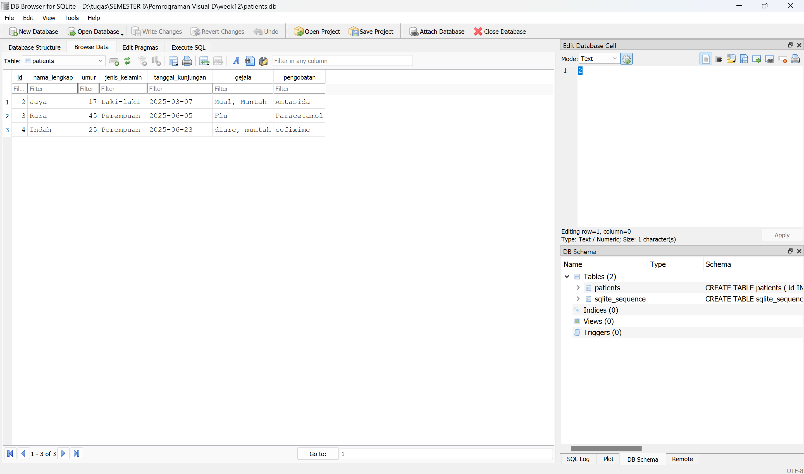

# Assignment Week 12 (Final Project)

<table align="center">
  <tr>
    <td align="center" colspan="2">
       
      <b>Tampilan awal ketika di run.</b>
    </td>
  </tr>
  <tr>
    <td align="center">
       
      <b>Ketika memilih ke tab "Ekspor CSV".</b>
    </td>
    <td align="center">
       
      <b>Ketika memilih menu tab file.</b>
    </td>
  </tr>
  <tr>
    <td align="center">
       
      <b>Ketika memilih menu tab edit.</b>
    </td>
    <td align="center">
       
      <b>Ketika memilih menu tab bantuan.</b>
    </td>
  </tr>
  <tr>
    <td align="center">
       
      <b>Tampilan ketika menambah data baru pasien.</b>
    </td>
    <td align="center">
       
      <b>Tampilan ketika berhasil menambah data pasien.</b>
    </td>
  </tr>
  <tr>
    <td align="center">
       
      <b>Tampilan ketika mencari pasien.</b>
    </td>
    <td align="center">
       
      <b>Tampilan ketika mengedit data pasien.</b>
    </td>
  </tr>
  <tr>
    <td align="center">
       
      <b>Tampilan ketika ingin menghapus data pasien.</b>
    </td>
    <td align="center">
       
      <b>Tampilan ketika berhasil meng-ekspor data pasien ke CSV.</b>
    </td>
  </tr>
  <tr>
    <td align="center">
       
      <b>Tampilan ketika belum mengisi semua field di "Add".</b>
    </td>
    <td align="center">
       
      <b>Tampilan ketika di menu bar File untuk "Simpan".</b>
    </td>
  </tr>
  <tr>
    <td align="center">
       
      <b>Tampilan ketika di menu bar Edit untuk "Hapus" dan belum memilih kolom yang ingin dihapus.</b>
    </td>
    <td align="center">
       
      <b>Tampilan ketika di menu bar bantuan untuk "Tentang Aplikasi".</b>
    </td>
  </tr>
  <tr>
    <td align="center">
       
      <b>Tampilan UI untuk halaman utama menggunakan Qt Designer.</b>
    </td>
    <td align="center">
       
      <b>Tampilan UI untuk halaman add menggunakan Qt Designer.</b>
    </td>
  </tr>
  <tr>
    <td align="center">
       
      <b>Tampilan SQLite untuk struktur di database patients.</b>
    </td>
    <td align="center">
       
      <b>Tampilan SQLite untuk tabel patients.</b>
    </td>
  </tr>
</table>
